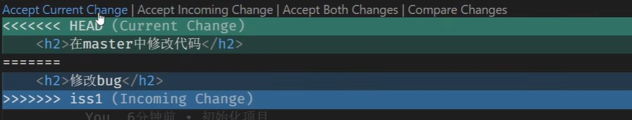
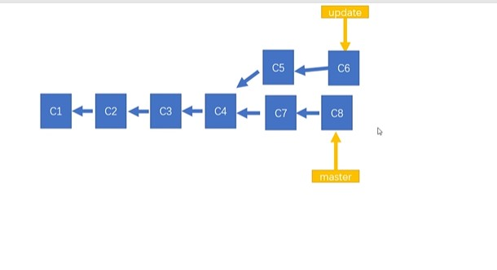
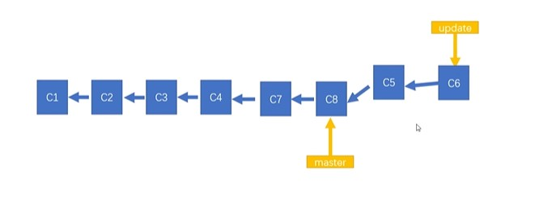

<h1 style="text-align:center">Git的使用教程</h1>

##  配置Git

​	git通过配置的用户和邮箱对提交的进行标识，表明代码是谁提交的。

+ 配置全局用户

```git
git config --global user.name "NickWiber"
```

+ 配置全局邮箱

```git
git config --global user.email "xxxxxxxxxxxx@qq.com"
```


##  Git文件状态

Git中文件有两种状态已跟踪和未跟踪；其中已跟踪有三种状态，暂存、已修改、未修改。

暂存：代码已修改并保存，但是未提交到git仓库。

已修改：标识文件已修改，和仓库中的文件不同。

未修改：标识磁盘中的文件和git仓库中文件相同，没有修改。

以上状态可以通过git status查看。


## Git的基本使用

1. git status 

   查看git仓库的状态

2. git init

   仓库初始化，会添加一个`.git` 的隐藏文件夹。

3. git add 文件名

   文件名可以用*来表示，代表把该目录先所有文件都进行管理，将项目中的文件让git进行管理即将文件切换到暂存状态。

4. git commit [-a] -m "提交信息"

   + 将暂存的文件存储到仓库中，文件状态有暂存------->未修改，修改文件后文件状态会变成修改状态。
   + git commit -a -m "xxxxxx",提交所有已修改的文件，未跟踪的文件不会提交。

5. git log

   查看代码操作记录。

## Git的常用命令  

1. git restore [fileName、*]

   回退项目到之前的版本，使用*表示所有文件进行回退。

   ```git
   git restore <fileName> //版本回退
   git restore *
   git restore --stage <fileName>  //取消暂存状态，不会取消操作
   ```

   

2. git rm  

   删除文件。 删除前需要将已修改的文件进行提交，对未提交的文件进行删除会报错，但可以使用-f强制删除进行删除。

   ```git
   git rm <fileName>
   git rm <fileName> -f //强制删除
   ```

3. git mv

   移动文件。

   ```git
   git mv [from] [to]  				//移动文件or重命名文件
   ```


## Git分支

Git在存储文件时，每一次提交文件都会创建一个对应的节点，通过节点来记录代码的当前状态。节点会构成一个树状结构，树状结构就意味着存在分支，默认仓库中只有一个分支，即master分支。在实际操作中可以创建多个分支，分支与分支之间相互独立，对分支的修改不会影响主分支。

```git
git branch		//查看当前分支
git branch <name>		//创建分支
git branch -d <name>	//删除分支
git switch <name> 		//切换分支命令1
git checkout <name>		//切换分支命令2
git switch -c <name>	//创建并切换分支
git branch -m <name>	//修改当前分支名
```

在开发中都是在自己的分支中修改代码，修改完成后，将自己的分支合并到组分支中。

```git
git merge <brantchName>		//快速合并分支，直接将master指针移到								最新的分支处
git brantch -d <brantchName>	//删除分支
```

如果在合并分支的过程中，出现了冲突，即分支和master中都修改了同一个文件，那么在合并分支的过程中就会出现冲突，就不能快速合并分支，需要手动处理分支，根据需要选择保留master中的内容or分支中的内容ormaster和分支中的内容均保留，也可以通过VSCode中的选项进行修改，然后再进行commit提交。



### Git变基（rebase）

在开发中还可以通过变基来合并分支。

通过merge合并分支，会将分支的创建、合并等操作记录全部显示出来，在实际开发过程中，开发人员很多，就会出现很多的分支操作，使得代码的提交记录很混乱。





在变基前，update分支的base为C4，通过变基可以将base从C4变为C8，C5和C6就与C8在一条分支上面，就可以使用快速合并， 就不会产生多余的记录。

原理（变基时发生了什么）：

1. 当我们发起变基的操作时，git会首先找到两条分支最近的公共祖先
2. 对比当前分支先对于祖先的历史提交（相对于祖先做了那些更新或者改变），并将他们提取出来保存在一个临时文件中
3. 将当前部分指向基底
4. 以新基底为起点，从新执行临时文件中的历史改变

变基的操作过程：

```git
git switch xxx				//切换到分支
git rebases master			//变基
							//有冲突则处理冲突
git commit					//提交更改
git switch master			//切换回master分支
git merge xxxxx				//快速合并
git branch -d xxx			//删除原分支
```

变基和merge对于合并分支来说结果是一样的，但是变基会使提交记录更加整洁，大部分情况下合并和变基可以互换，但是如果分支已经提交给了远端仓库，那么这时候尽量不使用变基，代码要在本地仓库完成变基之后再上传。

## 远程仓库

远程仓库和本地仓库没有区别，区别在于远程仓库可以被其他开发者查看。在实际开发中，git服务器通常是由公司搭建内部使用或者购买一些公共的私有服务器。常用的公共git仓库由：GitHub和Gitee（码云）

### 远端库的操作

```git
git remote							//显示出当前关联的远程仓库
git remote add <远端仓库名称> <url>	//关联远端仓库，其中远端仓库的名称可以自定，一般使用origion
git remote remove <远端仓库名称>		//删除远端仓库
git push -u <远端仓库名称> <分支名>		//和向远端仓库推送代码，并和当前分支关联起来
git push <远端仓库> <本地分支>:<远程分支>	//将本地分支推送到远端仓库的<远端分支>中
git clone <远端仓库URL>				//从远端仓库下载代码
git push 							//推送本地仓库代码到远端仓库，如果本地仓库代码版本低于远端仓库，则会推送失败
git featch							//在本地代码版本低于远端仓库的版本的情况下，想要成功推送则需要获取到远端最新的代码，使用										featch不会将下载的代码和本地代码合并，需要手动使用git mergy命令进行合并
git pull							//该命令同样用于获取远端的代码，次命令会自动合并代码
```

***注意***：**在推送代码之前一定要先从远程仓库中拉取新的代码**


## Git标签

### 分离head指针

- Git中默认head指针在随着代码的提交会自动指向master，但是如果代码需要回退到某个特定的版本，则需要使用`git switch`命令进行切换，同时还需要带上`--detach`参数，进行head指针的分离，才能回退成功。在分离头指针的情况下，也可以操作代码，但是这些操作并不会出现在任何分支上。尽量不要在分离头指针的情况下对仓库进行操作。
- 如果一定要回到前面的版本的代码进行操作，可以选择创建分支后再操作：`git switch -c <分支名> <提交ID>`。

```git
git switch <提交ID> --detach
```


### 标签

可以为提交记录打上标签，方便快速切回和查找。

```Git
git tag									//查看全部的标签
git tag 标签名								//为当前所在的节点打上标签
git tag 标签名 提交ID						//为特定的提交版本打上标签
git push 远程仓库 标签名					//将指定标签提交到远程仓库
git push 远程仓库 --tags					//推送所有标签到远程仓库
git tag -d 标签名							//删除标签
git push 远程仓库 --delete 标签名			//删除远仓库的标签
```

## Gitignore  

默认情况下git会监视项目文件夹中的所有文件，但是有的文件不需要被监视或者被上传到git中比如node_modules，则可以在项目中创建一个名叫`.gitignore`的文件，在里面写上忽略的文件名或者文件地址即可。


